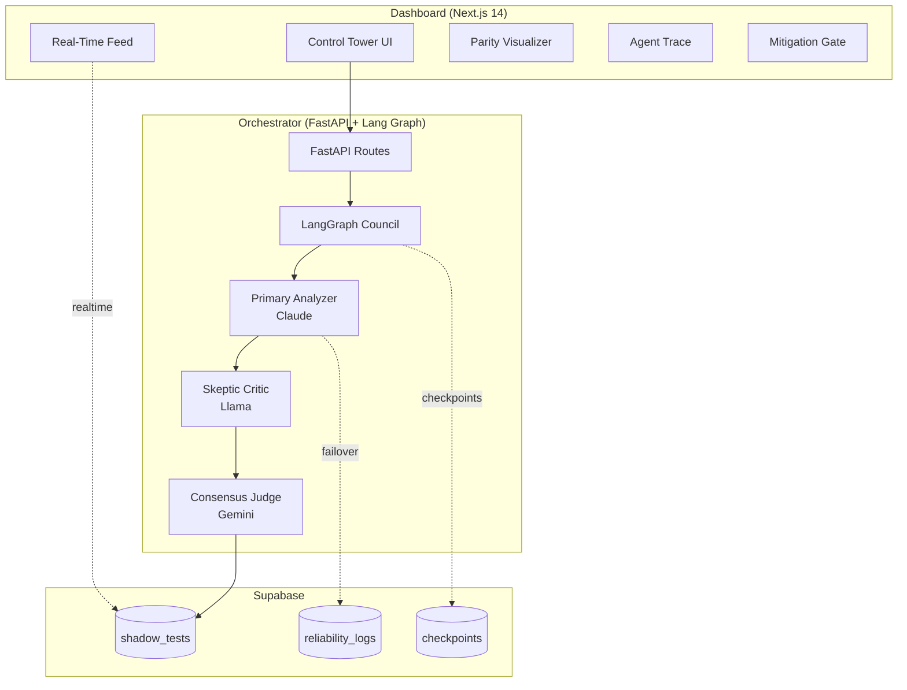

# Shadow Twin Guardian

A sophisticated multi-agent orchestration system leveraging **LangGraph** to manage a council of AI agents for e-commerce migration parity testing. The system uses multiple LLM providers with intelligent failover, real-time visualization, and human-in-the-loop capabilities.

## 🏗️ Architecture



## 📁 Project Structure

```
CyberCypher/
├── orchestrator/          # Python FastAPI + LangGraph backend
│   ├── app/
│   │   ├── agents/       # Multi-agent council (Primary, Skeptic, Judge)
│   │   ├── api/          # FastAPI routes
│   │   ├── core/         # Config & LLM manager with failover
│   │   ├── db/           # Supabase checkpointer
│   │   ├── graph/        # LangGraph state graph
│   │   └── models/       # Pydantic schemas & ShadowState
│   └── requirements.txt
├── dashboard/            # Next.js 14 React dashboard
│   ├── app/              # App Router pages
│   ├── components/       # React components
│   └── lib/              # Supabase client & types
├── shared/               # Shared resources
│   ├── migrations/       # Supabase SQL migrations
│   └── types/            # TypeScript & Python type definitions
├── .env.example          # Environment variables template
└── package.json          # Monorepo scripts
```

## 🚀 Quick Start

### Prerequisites

1. **Supabase Project**: Create a project at [supabase.com](https://supabase.com)
2. **API Keys**: Obtain keys for:
   - Anthropic (Claude)
   - Google (Gemini)
   - Optional: OpenAI
3. **Ollama** (optional): Install [Ollama](https://ollama.ai) and pull `llama3.2` for local failover

### Setup

1. **Clone and Install Dependencies**

```bash
# Install root dependencies (concurrently for dev)
npm install

# Install orchestrator dependencies
cd orchestrator
python -m venv venv
source venv/bin/activate  # On Windows: venv\Scripts\activate
pip install -r requirements.txt
cd ..

# Install dashboard dependencies
cd dashboard
npm install
cd ..
```

2. **Configure Environment**

```bash
# Copy example environment file
cp .env.example .env

# Edit .env and fill in your actual values:
# - SUPABASE_URL and keys
# - ANTHROPIC_API_KEY
# - GOOGLE_API_KEY
# - OLLAMA_BASE_URL (default: http://localhost:11434)
```

3. **Run Supabase Migrations**

```bash
# In your Supabase dashboard, run the SQL from:
# - shared/migrations/001_create_shadow_tests.sql
# - shared/migrations/002_create_reliability_logs.sql
# - shared/migrations/003_create_checkpoints.sql

# Or use Supabase CLI:
supabase db push
```

4. **Start Development Servers**

```bash
# Start both orchestrator and dashboard concurrently
npm run dev

# Or start independently:
npm run dev:orchestrator  # FastAPI on :8000
npm run dev:dashboard     # Next.js on :3000
```

5. **Access the Dashboard**

Open [http://localhost:3000](http://localhost:3000) in your browser.

## 🎯 Core Features

### 1. Multi-Agent Council

Three specialized AI agents deliberate on parity test results:

- **Primary Analyzer** (Claude-3.5-Sonnet): Deep-dive JSON diff analysis
- **Skeptic Critic** (Llama-3.2): Identifies false positives and semantic matches
- **Consensus Judge** (Gemini-1.5-Pro): Weighted vote fusion and final verdict

### 2. Intelligent Failover

- Automatic provider switching on failures (429, 500, timeout)
- Health tracking with consecutive failure limits
- Exponential backoff retry logic
- Reliability logging to database
- Fallback to local Ollama when cloud APIs fail

### 3. State Persistence

- LangGraph checkpointing via Supabase
- Full state saved at each super-step
- Replay and debugging capabilities

### 4. Enterprise Dashboard

- **Real-Time Feed**: Live test updates via Supabase postgres_changes
- **Parity Visualizer**: Side-by-side JSON diff comparison
- **Agent Trace**: React Flow visualization with live node pulsing
- **Reliability Badge**: Current provider health status
- **Mitigation Gate**: Human-in-the-loop for high-risk verdicts

### 5. Edge Case Handling

- **Empty Diffs**: Skip council and mark as PASS
- **Rate Limits**: Exponential backoff and failover
- **Orphaned Tests**: Stale signal warning after 5 minutes
- **All Providers Down**: Graceful degradation with error logging

## 📡 API Reference

### POST /api/analyze

Trigger a new parity test evaluation.

**Request:**
```json
{
  "test_id": "test-123",
  "merchant_id": "merch-456",
  "legacy_response": { ... },
  "headless_response": { ... },
  "diff_report": { ... }
}
```

**Response:**
```json
{
  "test_id": "test-123",
  "status": "pending",
  "message": "Analysis started successfully"
}
```

### GET /api/status/{test_id}

Get current test status.

**Response:**
```json
{
  "test_id": "test-123",
  "status": "complete",
  "final_verdict": "PASS",
  "risk_score": 0.15,
  "council_opinions": [...],
  ...
}
```

### WebSocket /ws/tests/{test_id}

Real-time test updates.

### GET /api/health/providers

Get LLM provider health status.

### POST /api/mitigate/{test_id}

Mark a test as mitigated (human review complete).

## 🧪 Testing

```bash
# Run orchestrator tests
cd orchestrator
pytest tests/ -v

# Test failover logic
pytest tests/test_llm_manager.py -v

# Test council graph
pytest tests/test_council_graph.py -v
```

## 🔧 Configuration

Key environment variables:

| Variable | Description | Default |
|----------|-------------|---------|
| `SUPABASE_URL` | Supabase project URL | Required |
| `SUPABASE_ANON_KEY` | Supabase anon key | Required |
| `ANTHROPIC_API_KEY` | Claude API key | Required |
| `GOOGLE_API_KEY` | Gemini API key | Required |
| `OLLAMA_BASE_URL` | Local Ollama endpoint | `http://localhost:11434` |
| `MAX_RETRIES` | Max retry attempts | `3` |
| `RETRY_DELAY_SECONDS` | Initial retry delay | `2` |

## 🐛 Troubleshooting

**Dashboard shows "Stale Signal"**
- Check if orchestrator is running (`http://localhost:8000/health`)
- Verify Supabase realtime is enabled for `shadow_tests` table

**"All Providers Down"**
- Verify API keys in `.env`
- Check provider status on their dashboards
- Ensure Ollama is running locally: `ollama serve`

**Empty Agent Trace**
- Select a test from the Real-Time Feed
- Check browser console for errors
- Verify test has council opinions

## 📝 License

MIT

## 👥 Team

Built for the CyberCypher team:
- **Keshav**: Orchestrator & UI
- **Aayush**: API Layer & Ollama
- **Aakash**: ML & DB Logic
